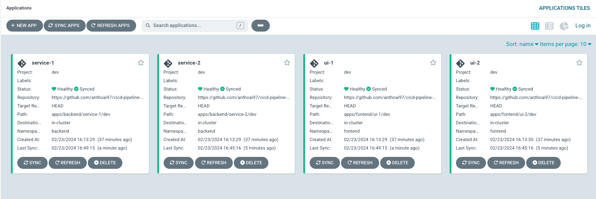
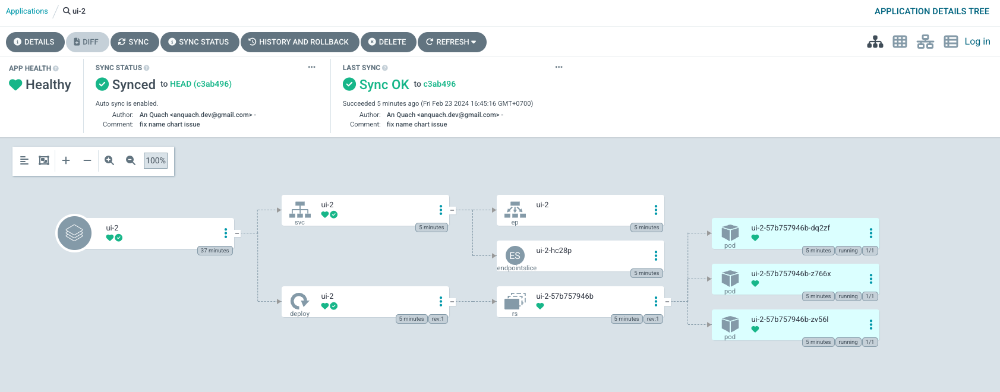

# Microservices CI/CD Pipeline Stack

## Overview
Example full pipeline stack CI/CD for deploy code from git to Kubernetes of microservice system

## Architecture


## Result





## Deeper Describe

Applications are deployed using Helm. Each application has a "dev", "test" and "prod" sub-directory corresponding to the environments used in the application release promotion process.

```
apps
├── backend
    ├── service-1
        ├── dev
        │   ├── Chart.yaml
        │   └── values.yaml
        ├── prod
        │   ├── Chart.yaml
        │   └── values.yaml
        └── test
            ├── Chart.yaml
            └── values.yaml
```

Each helm chart uses dependency management to pull in the correct chart version. In this case the [ba-service](https://github.com/anthoai97/cicd-pipeline-stack-for-microservices/tree/master/charts) repository is publishing a versioned Helm chart.

```
apiVersion: v2
appVersion: v1.0.0
dependencies:
  - alias: app
    name: be-service
    repository: https://anthoai97.github.io/cicd-pipeline-stack-for-microservices
    version: 0.0.3
description: A Helm chart for Spring Boot demo application
name: service-1
type: application
version: "1.16.0"
```

The values.yaml file is used to customize any settins for the target environment

```
app:
  nameOverride: "service-1"
  replicaCount: 1
```

## ArgoCD configuration

Each environment type is represented within ArgoCD as a [Project](https://argo-cd.readthedocs.io/en/stable/user-guide/projects/). There is an additional [ApplicationSet](https://argo-cd.readthedocs.io/en/stable/user-guide/application-set/) to generate the Application configuration for each deployment using helm.

```
argocd
├── dev
│   ├── ApplicationSet.yaml
│   └── AppProject.yaml
├── prod
│   ├── ApplicationSet.yaml
│   └── AppProject.yaml
└── test
    ├── ApplicationSet.yaml
    └── AppProject.yaml
```

Notes:

* The environment settings are contained in separate directories, enabling them to be deployed to different Kubernetes clusters

# Testing Helm charts

The following command will download the remote helm chart dependencies

```
helm dependencies update apps/backend/service-1/dev

```

These are stored locally as follows

```
apps/backend/service-1
└── dev
    ├── Chart.lock
    ├── Chart.yaml
    └── charts
        └── abc-1.0.1.tgz
```

Now possible to review the generated YAML manifests for Kubernetes

```
helm template rel1 apps/backend/service-1/dev
```
